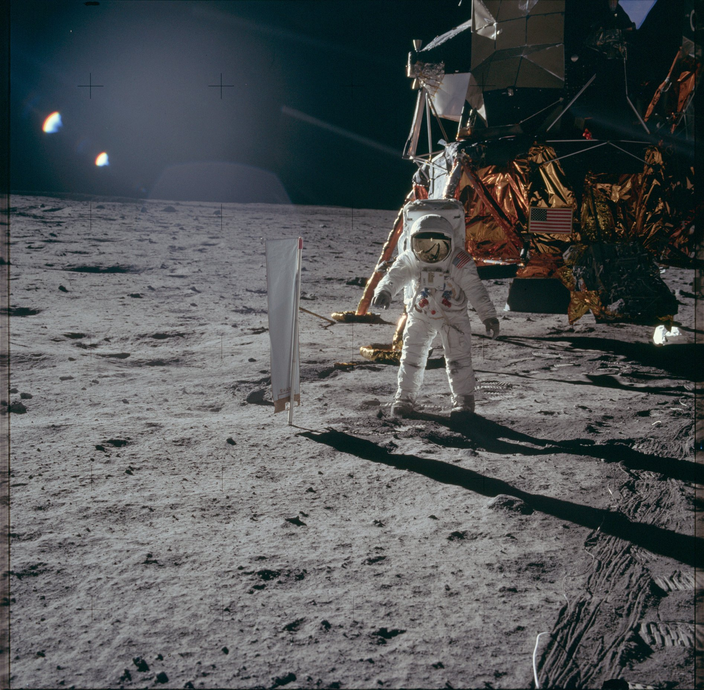
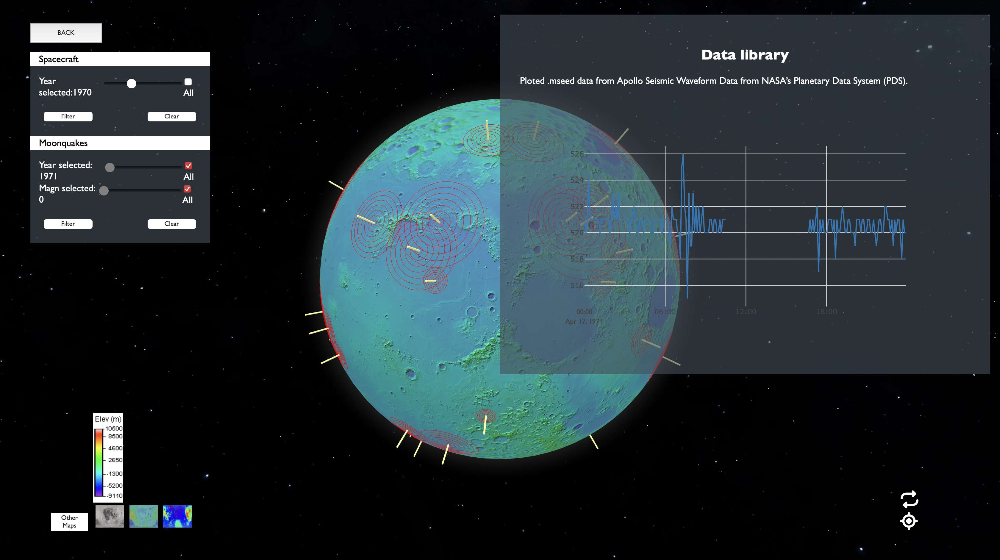

<a name="readme-top"></a>

<!-- PROJECT LOGO -->
<br />
<div align="center">
  

  <h3 align="center">Make a Moonquake Map 2.0!</h3>

  <p align="center">
    Documentation about Oceanus Procellarum's project for the NASA SpaceApps Challenge 2023
    <br />
    <a href="https://github.com/asiernc/makeAMoonquake2.0/tree/main/docs"><strong>Explore the full docs »</strong></a>
    <br />
    <br />
    <a href="https://github.com/asiernc/makeAMoonquake2.0">View Demo</a>
  </p>
</div>


<!-- TABLE OF CONTENTS -->
<details>
  <summary>Table of Contents</summary>
  <ol>
    <li><a href="#about-the-project">About The Project</a></li>
    <li><a href="#getting-started">Getting Started</a></li>
    <li><a href="#usage">Usage</a></li>
    <li><a href="#roadmap">Roadmap</a></li>
    <li><a href="#contributing">Contributing</a></li>
    <li><a href="#contact">Contact</a></li>
    <li><a href="#acknowledgments">Acknowledgments</a></li>
  </ol>
</details>


<!-- ABOUT THE PROJECT -->
## About The Project

[](https://github.com/asiernc/makeAMoonquake2.0)

### Main Theme

The "Apollo Seismic Data Exploration" project is a collaborative initiative that delves into the wealth of seismic data collected during NASA's historic Apollo missions. Our mission is to unlock the fascinating world of lunar seismology and make it accessible to both non-scientists and scientists alike. 

### Target Audience

#### Non-Scientists

Are you curious about the Moon and its hidden secrets? Join us on a journey to unravel the mysteries beneath the lunar surface. Our project is designed with you in mind, providing user-friendly ui as well-known tools and visualizations to help you understand the seismic activities and other interesting data on the Moon and their collection.

#### Scientists and Researchers

For the scientific community, our project offers a valuable resource for analysis and visualization of the NASA collected data. Whether you're a seasoned lunar geologist or a budding seismologist, you'll find a treasure trove of data and tools to advance your research and contribute to our collective understanding of lunar behaviors.

### NASA Apollo Seismic Experiment

The Passive Seismic Experiment was the first seismometer placed on the Moon’s surface. It detected lunar "moonquakes" and provided information about the internal structure of the Moon.

This experiment studied the propagation of seismic waves through the Moon and provided the first detailed look at the Moon's internal structure.

<p align="right">(<a href="#readme-top">back to top</a>)</p>


### Built With [Only open source]

The following tecehnologies and frameworks has been used to implement this project:

REACT - Web App
* React - Globe.js
* React - Plotly.js
* Papaparse
* Axios

PYTHON - API & Data treatment
* Uvicorn
* FastAPI
* Obspy
* Numpy
* Pandas


<p align="right">(<a href="#readme-top">back to top</a>)</p>


<!-- GETTING STARTED -->
## Getting Started

To deploy this project to your own infrastructure follow the next steps:

### Prerequisites

```sh
# All
npm install npm@latest yarn -g

# Linux
sudo apt install python3 python3-pip

# MacOS
brew install python pip
```

### Installation

1. Clone the repo
```sh
git clone https://github.com/asiernc/makeAMoonquake2.0
```
2. Install NPM packages
```sh
# From root dir
cd ./front
yarn install
```
3. Install Python modules
```sh
# From root dir
cd ./back
pip install -r requirements.txt
```

<p align="right">(<a href="#readme-top">back to top</a>)</p>


<!-- USAGE EXAMPLES -->
## Usage

Once you install the dependencies, now you can run our interactive moon data viewer!

```sh
# From root dir
cd ./front
yarn start

# From root dir
cd ./back
python api.py
```

Now you can navigate to _http://localhost:3000_ to start your journey into the moon!

<p align="right">(<a href="#readme-top">back to top</a>)</p>

<!-- ROADMAP -->
## Roadmap

- [x] Add interactive plots to go deep into data visualisation
- [x] Add moon controls
- [x] Link interactive data with extended data
- [x] Add surface layers
- [ ] Eficiency fetching data
- [ ] Add Additional visual data
- [ ] Add a Moon Phases layer and controls
- [ ] Add VR mode!
- [ ] And more...


See the [open issues](https://github.com/othneildrew/Best-README-Template/issues) and porpose your own features and known issues, thanks :).
<p align="right">(<a href="#readme-top">back to top</a>)</p>


<!-- CONTRIBUTING -->
## Contributing

Contributions are what make the open source community such an amazing place to learn, inspire, and create. Any contributions you make are **greatly appreciated**.

If you have a suggestion that would make this better, please fork the repo and create a pull request. You can also simply open an issue with the tag "enhancement".
Don't forget to give the project a star! Thanks again!

1. Fork the Project
2. Create your Feature Branch (`git checkout -b feature/AmazingFeature`)
3. Commit your Changes (`git commit -m 'Add some AmazingFeature'`)
4. Push to the Branch (`git push origin feature/AmazingFeature`)
5. Open a Pull Request

We will review ASAP!
<p align="right">(<a href="#readme-top">back to top</a>)</p>


<!-- CONTACT -->
## Contact

Genís Martínez Moreno - [@fenixg98](https://github.com/fenixG98) - fenixg98@icloud.com

Genís Martínez Moreno - [@asiernc](https://github.com/asiernc) - asierncara@gmail.com


Project Link: [https://github.com/asiernc/makeAMoonquake2.0](https://github.com/asiernc/makeAMoonquake2.0)

<p align="right">(<a href="#readme-top">back to top</a>)</p>


<!-- ACKNOWLEDGMENTS -->
## Acknowledgments

Many thanks to the NASA for the opportunity and the data.
Many many thanks to the Málaga SpaceApps Challenge organizers and Málaga 42 staff.

And thank you very much for taking the time to learn about our mission.

Se you soon astrohacker!